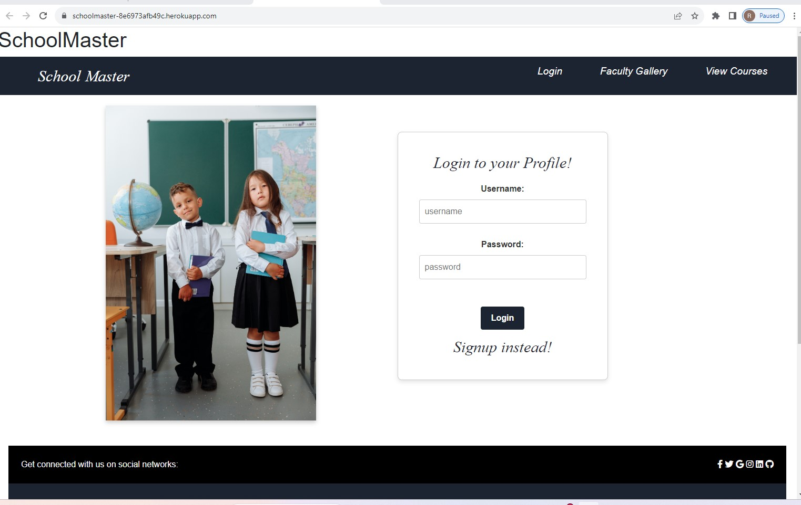
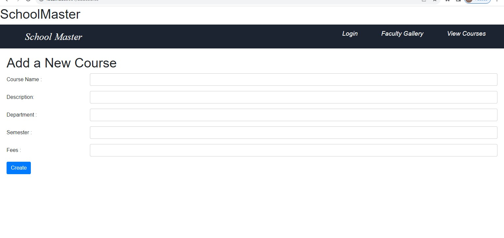
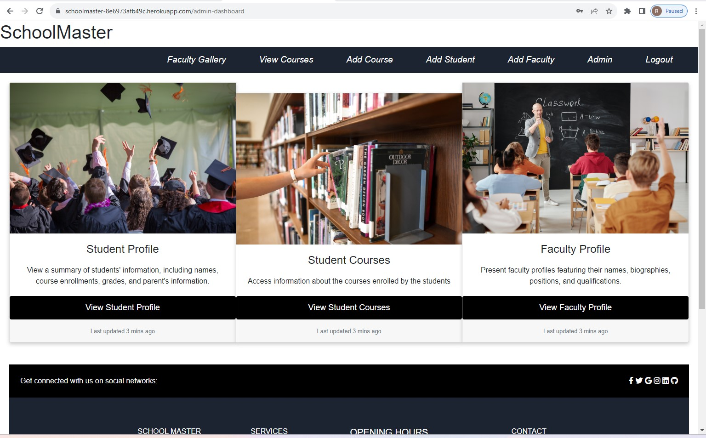
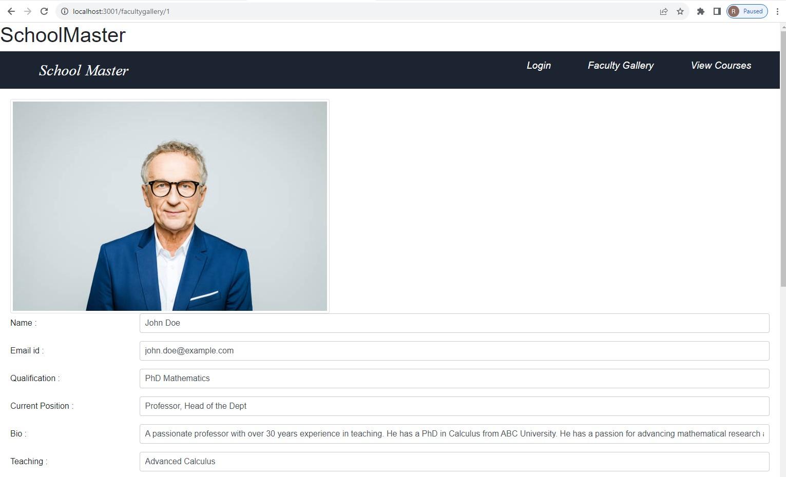

# SchoolMaster

[](https://opensource.org/licenses/MIT)

## Description
 School Master Application is built using modern web technologies such as  Handlebars, Javascript, CSS, Node and Express js
, MySQL and follows best practices for manage studemt,admin and faculty data .It is an effective tool for educational institution to manage School data .

## Table of Contents
- [User-Story](#user-story)
- [Acceptance-Criteria](#acceptance-criteria)
- [Installation](#installation)
- [Usage](#usage)
- [License](#license)
- [Contributing](#contributing)
- [Test](#test)
- [Questions](#questions)

## User-Story

```
AS A user
I WANT to use a robust and user-friendly system to manage admin,faculty and student information effectively
SO THAT I can organize my the courses and keep track of students, faculy, and programs in one place.
```


## Acceptance-Criteria

```
Given a school management system,
When I visit the site,then I am presented with a homepage which includes a dashboard with navigation links and login or sign up option.
When I choose to sign up, then I am prompted to create a username and password.
When I choose to login, then I am prompted to enter my username and password.
It's done when an existing user can enter their credentials on the login page to create a session on the server.
It's done when a new user can create an account on the login page and then be immediately logged in with a session.
WHEN I revisit the site at a later time and choose to sign in,THEN I am prompted to enter my username and password
WHEN I am signed in to the site, THEN I see navigation links for the homepage, the dashboard, and the option to log out.
WHEN I click on the homepage option in the navigation,THEN I am taken to the homepage and presented with existing courses and students and has the options to create, delete and update courses, students and academic years.
When I click on an academic year, then I am presented with a list of courses offered in that year.
When I click on a course, then I am presented with a list of students enrolled in that course.
When I click on the option to create new courses, then I am prompted to enter the name of the new course, academic year, faculty name, and a brief description of the course goals.
When I click on the option to create a new student, then I am prompted to enter the name of the new student, year of enrollment, courses taken,email, phone number, address.
When I click on the option to update course information, then I am given a list of courses available to update.
When I click on the option to update a particular course, then I am provided with the current course information, which can be edited.
When I click on the option to update student information, then I am given a list of courses available to update.
When I click on the option to update a particular student, then I am provided with the current course information, which can be edited.
When I click on the option to delete a course, then I am presented with a list of courses to delete with an option to remove one of them from the records.
When I click on the option to delete a student, then I am presented with a list of students to delete with an option to remove one of them from the records.
```

## Instructions
💻   
Run the following command at the terminal:
`mysql -u root -p` <br>
`npm run seed` <br>
`npm start` or 
`npm run nodemon`
`http://localhost:3001/`


## Installation
1. Clone the repository
2. Install the following: 
- Node.JS [Version 16.18.1](https://nodejs.org/en/blog/release/v16.18.1/)
- Inquirer.js: [Version 8.2.4](https://www.npmjs.com/package/inquirer/v/8.2.4)
- [express-handlebars](https://www.npmjs.com/package/express-handlebars)
- [MySQL2](https://www.npmjs.com/package/mysql2)
- [Sequelize](https://www.npmjs.com/package/sequelize) 
- [dotenv package](https://www.npmjs.com/package/dotenv) 
- [bcrypt package](https://www.npmjs.com/package/bcrypt)
- [express-session](https://www.npmjs.com/package/express-session)
- [connect-session-sequelize](https://www.npmjs.com/package/connect-session-sequelize)
-  [express-handlebars](https://www.npmjs.com/package/express-handlebars)
- [express-session](https://www.npmjs.com/package/express-session)
- [nodemon](https://www.npmjs.com/package/nodemon)

## License
This app is covered under MIT license. For details and limitations of this license please visit:
[License Link for MIT](https://opensource.org/licenses/MIT)


## Contributing
This app has been possible with great work and contribution of the following colleagues:<br>
    - soniasebastian [GitHub - link](https://github.com/soniasebastian)<br>-Login/Signup is done by Sonia
    -  rbala [GitHub - link](https://github.com/rbala16)<br>-Admin/Student/faculty dashboard,Nodemon  package installation and styling - CSS ,README file and footer handlebars are done by Rajni
    - sumanpreetk01 [GitHub - link](https://github.com/sumanpreetk01)<br>-Add courses,update courses done by Suman<br>
   Note:  make sure to test you add  this url in the address bar ,e.g(http://localhost:3001/updatecourse/1) (whatever the course id you want to update).
    -SwathiVinod19 [GitHub - link](https://github.com/SwathiVinod19)<br>-Faculty/Student profile and add faculty profile and add -Student is done ny Swathi,<br>
    Note:When you add Faculty ,you need to add url of the image ,you can add because new faculty image would be only added,when new faculty will hire in school
    - main handlers is done by Sonia  and Rajni
    -Presentation and layout is done by Sonia/Swathi/Sam/Rajni/Suman

## Mockup
The following animation demonstrates the application functionality:
 
 
 
 
 


## Questions
If you have any questions, you can email us .<br>
  : <sam@dinozio.design><br>
  : <soniasebastian011@gmail.com><br>
  : <bala12rajni@gmail.com><br>
  : <swathi.vinod@gmail.com><br>
  : <sumanpreetk01@gmail.com>

 ## Important Link

You are required to submit BOTH of the following for review:

* The URL of the functional, deployed application.<br>
https://schoolmaster-8e6973afb49c.herokuapp.com/

* The URL of the GitHub repository, with a unique name and a readme describing the project.<br>
https://github.com/dinozio-design/SchoolMaster<br>


### Authors Notes: 
  _This README and accompanying repo have been brought to you by:_<br>© Rajni bala,Sonia Sebastian,Sumanpreet Kaur,am Azimi,Swathi Vinod - 2023 CodeCamp Student<br>Confidential and Proprietary. All Rights Reserved.